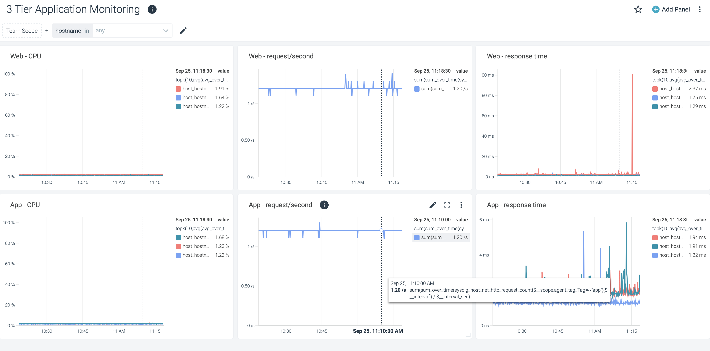
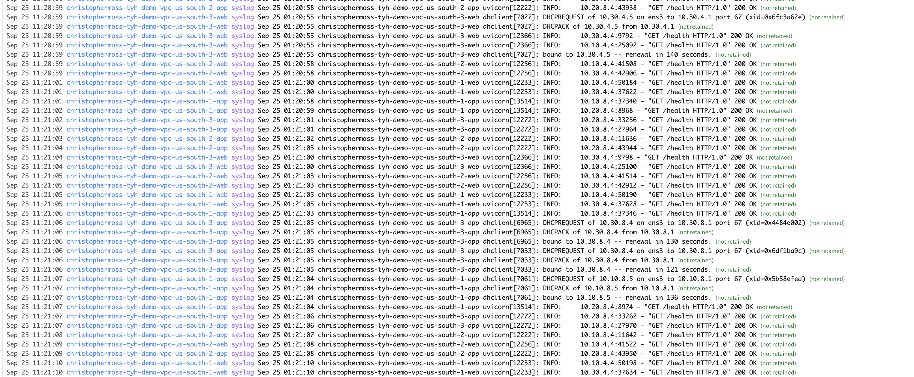

# Deploy a 3 Tier Autoscale demo application on IBM Cloud VPC

This terraform template will deploy a functional demo application which demonstrates the IBM Cloud capabiltity to host a highly available, secure, public facing Web Application, which will autoscale under load conditions. This is an extension to the standard 3 Tier demo which adds the dimension of auto-scaling.

The following resources are deployed through this demo:

- A single VPC and Resource Group.
- A public facing and a private Load Balancer.
- 6 application subnets across three zones and a single subnet for the Bastion server.
- An autoscale group for both App and Web instances, including a relevant Instance Temlate for each.
- Security groups to create secure zones to host the application components.
- A Bastion server with a Floating IP and port 22 access to the web and application components.
- A Postgress database deployed as , which is itself made 
- Observability components -> Logging, Monitoring and Activity Tracker.
- The demo application deployed via ansible.
- A stress testing application which may be run from the Bastion server.


Functionally, requests will pass through the Web Load Balancer from the internet and be routed to the Web Servers which will in turn route requests to the App Servers through the App Load Balancer. Failure of any VSI, or, an entire zone will be handled transparently to the user. It should be noted that IBM Cloud ensures high avilability of the Load Balancers and Postgress across zones in a region.

When the Group Manager detects high aver CPU on the VSI's deployed to the group, a Scale event will occur which will create a new VSI. This process will be repeated until the average CPU is below the threshold value. COnversely, as load is decreased, the number of VSI's will decrease until the minimum number is reached.

*Note on VSI Versions: This demo has been tested on flavors of Ubuntu only*

# Running this demo

* This demo has been tested on a workstation running terraform only. IBM Cloud Schematics will likely work, however, this has not been tested.

## Compatibility

- Terraform 1.1 and above.
- IBM Cloud Terraform provider 1.44.0 and above

## Pre-Requisites

### Terraform version
Be sure you have the correct Terraform version, you can choose the binary here for your operating system:

- https://releases.hashicorp.com/terraform/

### IBM Cloud terraform provider
Be sure that you have access to the IBM Cloud terraform provider plugins through Internet or that you have downloaded and compiled the plugins for your operating system on $HOME/.terraform.d/plugins/

- [terraform-provider-ibm](https://github.com/IBM-Cloud/terraform-provider-ibm)

### IBM Cloud Account

An IBM Cloud account is required to run this demo.

### SSH Keys

Ensure that a SSH key is present in the same resource group and region where the cluster is being provisioned and our automation supports only one ssh key that can be attached to the application nodes. If you do not have an SSH key in your IBM Cloud account, create one by using this link [SSH keys](https://cloud.ibm.com/docs/vpc?topic=vpc-ssh-keys).

### IBM Cloud Region

Name of the IBM Cloud region where the resources need to be provisioned.(Examples: us-east, us-south, etc.) For more information, see [Region and data center locations for resource deployment](https://cloud.ibm.com/docs/overview?topic=overview-locations).

## Configure variables

This is a minimal touch demo, it is not reccomended that the internal variables are manipulated with the exception of those variables located in the **terraform.tfvars.template** Locate the terraform.tfvars.template file and rename to terraform.tfvars and enter you local variables. Alternatively, variable defaults may be set by creating terraform environment variables, for example:

For example..

```bash

ibmcloud_api_key=<<<ADD API KEY>>>
region=<<<ADD REGION>>>
ssh_key_name=<<<ADD KEY NAME>>
resource_prefix=<<ADD RANDOM PREFIX>>

logging_instance_plan=lite

```
**Note on logging instance plan:** By default the *lite* plan is used as this is the free tier. This tier suffers limitations when for customer demonstrations where the Activity Tracker or Logging Instance is used in any serious way. Please consider setting this variable to *7-day* in this case.

## Run the template

To run the template.

1. Clone this git repo terraform template to your local workstation. (git clone <GITADDRESS>)
2. Set environment variables or modify the terraform.tfvars file.
3. Run terraform. (Use -var-file only when setting vars in the tfvars file)

```bash

> terraform apply -auto-approve -var-file=terraform.tfvars

..
..
..

instances = {
  "demo-vpc-zone1-bastion" = {
    "floating_ip" = "150.240.69.93"
    "primary_ip" = "10.10.12.4"
  }
}
lb_back = "http://61cc19cc-us-south.lb.appdomain.cloud:8000/"
lb_front = "http://fbc1b5af-us-south.lb.appdomain.cloud/"
poolidmap = {
  "app-pool" = "r006-96500297-825a-4e72-818e-a7fa5b35e230"
}

```

*Please note: It will take a few minutes for the application to become visible once the terraform template has completed. This is due to the application configuration being trigger from user_data which from the perspective of terraform is a non-blocing operation.*

## Verification

All IBM Cloud Resources will be prefixed with **resource_prefix** and a randomly generated number.

### Validating the application

From the output, (lb_front=http://f84d6224-us-south.lb.appdomain.cloud/) identify the Web Load Balancer address, which is accessible from public internet. Simply use a browser to navigate to this address, the following should be displayed.

```
{"uname":"christophermoss-tyh-demo-vpc-us-south-3-web","floatin_ip":"52.118.99.247","private_ip":"10.30.4.5"}

```

This json record shows the web server which the Load Balancer forwarded traffic to, refreshing the browser should show different results.

Cycle through the following URL's.

- /postgresql
- /increment
- /cpu_load?load=6

### Accessing the Bastion Server

The Bastion Server may be accessed from a workstation which holds the private key of the **SSH Key** specificed when running the template. The public IP Address (Floating IP) may be found in the terraform output:

```
  "demo-vpc-zone1-bastion" = {
    "floating_ip" = "150.240.66.91"
    "primary_ip" = "10.10.12.4"
  }

```

To access the bastion server from a workstation:

```
>ssh root@150.240.66.91


The authenticity of host '150.240.66.91 (150.240.66.91)' can't be established.
ECDSA key fingerprint is SHA256:6rNCEbBwn7oo5FwW1LU4Sp8nZBB7Ff7C+OyajUZ7L2g.
Are you sure you want to continue connecting (yes/no/[fingerprint])? yes
Warning: Permanently added '150.240.66.91' (ECDSA) to the list of known hosts.
Welcome to Ubuntu 18.04.6 LTS (GNU/Linux 5.4.0-1031-ibm x86_64)

 * Documentation:  https://help.ubuntu.com
 * Management:     https://landscape.canonical.com
 * Support:        https://ubuntu.com/advantage

  System information as of Sat Sep 24 22:58:33 UTC 2022

  System load:  0.0               Processes:           96
  Usage of /:   1.8% of 96.73GB   Users logged in:     0
  Memory usage: 2%                IP address for ens3: 10.10.12.4
  Swap usage:   0%

 * Super-optimized for small spaces - read how we shrank the memory
   footprint of MicroK8s to make it the smallest full K8s around.

   https://ubuntu.com/blog/microk8s-memory-optimisation

41 updates can be applied immediately.
39 of these updates are standard security updates.
To see these additional updates run: apt list --upgradable

New release '20.04.5 LTS' available.
Run 'do-release-upgrade' to upgrade to it.


Last login: Sat Sep 24 10:16:44 2022 from 144.134.110.209

```

Deployed VSI's can only be reached through the Bastion server.

### Observability

It is important, particularly under load testing if the desire is to demonstrate Observability to access the Dashboard for:

- Activity Tracker (Show scale in and scale out events)
- Logging (Show all application logs)
- Monitoring (A pre-defined 3 tier dashboard will show basic performance and throughput data.)

## Load testing

Load testing is performed from a workstation, or, the Bastion Server. The format of the command is:

> locust -f ./locustfile.py -H <<LB_FRONT> --headless -u <USERS> -r <RAMPUP>

Where

- **LB_FRONT** = The URL of the web load balancer.
- **USERS** = The number of simulated users.
- **RAMPUP** = The number of users to add each cycle as we ramp up to the max users.

For example, from the Bastion server run:

```

locust -f ./locustfile.py -H http://f84d6224-us-south.lb.appdomain.cloud --headless -u 50 -r 1

[2022-09-24 23:03:57,388] christophermoss-tyh-demo-vpc-us-south-1-bastion/WARNING/locust.main: System open file limit '1024' is below minimum setting '10000'.
It's not high enough for load testing, and the OS didn't allow locust to increase it by itself.
See https://github.com/locustio/locust/wiki/Installation#increasing-maximum-number-of-open-files-limit for more info.
[2022-09-24 23:03:57,388] christophermoss-tyh-demo-vpc-us-south-1-bastion/INFO/locust.main: No run time limit set, use CTRL+C to interrupt
[2022-09-24 23:03:57,388] christophermoss-tyh-demo-vpc-us-south-1-bastion/INFO/locust.main: Starting Locust 2.8.6
 Name                                                                              # reqs      # fails  |     Avg     Min     Max  Median  |   req/s failures/s
----------------------------------------------------------------------------------------------------------------------------------------------------------------
----------------------------------------------------------------------------------------------------------------------------------------------------------------
 Aggregated                                                                             0     0(0.00%)  |       0       0       0       0  |    0.00    0.00

[2022-09-24 23:03:57,389] christophermoss-tyh-demo-vpc-us-south-1-bastion/INFO/locust.runners: Ramping to 20 users at a rate of 1.00 per second
 Name                                                                              # reqs      # fails  |     Avg     Min     Max  Median  |   req/s failures/s
----------------------------------------------------------------------------------------------------------------------------------------------------------------
----------------------------------------------------------------------------------------------------------------------------------------------------------------
 Aggregated                                                                             0     0(0.00%)  |       0       0       0       0  |    0.00    0.00

```

During load testing the Observability features should be observed in a browser to see the effect of load on the system and how these feature assist in understanding the state of system components, the user experience and troubleshooting data should an issue occur.

**50 concurrent users should be enough for the environment to scale out to around 8 concurrent Web Instances.


# Architectural points of interest

## Secure zones

The application components are deployed across multiple zones on unique subnets. This in itself is not enough to ensure the network security. The concept of secure zones is implemented via *Security Groups* which are attached to VSI Instances rather than subnets. In this was we can isolate the application zones and the Load Balancers from each other and the outside world and provide only the minimal access inbound and outbound to each secure zone.

This concept has been impemented as follows:


The Security Groups apply across zones within a Region. In the example above we isolate traffic to and from each zone through the use of Security Groups. The terraform template has defined these security groups as follows:

```bash
variable "vpc_security_groups" {

  description = "Map of security groups and rules"
  default = {
    load-balancer-front = [
      {
        name      = "allow-inbound-80"
        direction = "inbound"
        remote    = "0.0.0.0/0"
        tcp = {
            port_max = 80
            port_min = 80
        }
      },
      {
        name      = "allow-outbound-8000"
        direction = "outbound"
        remote_id = "web-tier"
        tcp = {
            port_max = 8000
            port_min = 8000
        }
      }
    ],
    load-balancer-back = [
      {
        name      = "allow-inbound-8000"
        direction = "inbound"
        remote_id = "web-tier"
        tcp = {
            port_max = 8000
            port_min = 8000
        }
      },
      {
        name      = "allow-outbound-8000"
        direction = "outbound"
        remote_id = "app-tier"
        tcp = {
            port_max = 8000
            port_min = 8000
        }
      }
    ],
    web-tier = [
      {
        name      = "allow-inbound-8000"
        direction = "inbound"
        remote_id = "load-balancer-front"
        tcp = {
            port_max = 8000
            port_min = 8000
        }
      },
      {
        name      = "allow-outbound-8000"
        direction = "outbound"
        remote_id = "load-balancer-back"
        tcp = {
            port_max = 8000
            port_min = 8000
        }
      },
      {
        name      = "allow-bastion-22"
        direction = "inbound"
        remote_id    = "bastion"
        tcp = {
            port_max = 22
            port_min = 22
        }
      },
      {
        name      = "allow-web-2-public"
        direction = "outbound"
        remote    = "0.0.0.0/0"
        tcp = {
            port_max = 65535
            port_min = 1
        }
      },
      {
        name      = "allow-web-cse"
        direction = "outbound"
        remote    = "166.8.0.0/14"
        tcp = {
            port_max = 65535
            port_min = 1
        }
      }
    ],
    app-tier = [
      {
        name      = "allow-inbound-8000"
        direction = "inbound"
        remote_id = "load-balancer-back"
        tcp = {
            port_max = 8000
            port_min = 8000
        }
      },
      {
        name      = "allow-bastion-22"
        direction = "inbound"
        remote_id    = "bastion"
        tcp = {
            port_max = 22
            port_min = 22
        }
      },
      {
        name      = "allow-app-public"
        direction = "outbound"
        remote    = "0.0.0.0/0"
        tcp = {
            port_max = 65535
            port_min = 1
        }
      },
      {
        name      = "allow-app-cse"
        direction = "outbound"
        remote    = "166.8.0.0/14"
        tcp = {
            port_max = 65535
            port_min = 1
        }
      }
    ],
    bastion = [
      {
        name      = "allow-bastion-22"
        direction = "inbound"
        remote    = "0.0.0.0/0"
        tcp = {
            port_max = 22
            port_min = 22
        }
      },
      {
        name      = "allow-bastion-public"
        direction = "outbound"
        remote    = "0.0.0.0/0"
        tcp = {
            port_max = 65535
            port_min = 1
        }
      },
      {
        name      = "allow-bastion-web-tier-22"
        direction = "outbound"
        remote_id    = "web-tier"
        tcp = {
            port_max = 22
            port_min = 22
        }
      },
      {
        name      = "allow-bastion-app-tier-22"
        direction = "outbound"
        remote_id    = "app-tier"
        tcp = {
            port_max = 22
            port_min = 22
        }
      }
    ]
  }
}

```
We can see for example that only the Bastion Server can access the application VSI's through port 22.


## Application Deployment

Applications are deployed through Ansible which is boot-strapped from the instance *user_data* when an instance is created. Terraform variables define Roles for the server:

```bash
                  web = {
                    type = "instance"
                    vpc_instance_type = "app-instance-linux"
                    security_groups = ["web-tier"]
                    floating_ip = false
                    propegate_keys = false
                    tags = ["web"]
                    roles = ["logdna", "sysdig", "demo"]
                  }


```

In this case we can see that from the roles that a web instance will have the following Ansible Roles deployed:

- logdna
- sysdig
- demo

Note the TAGS variable, this will describe the instance and influence how software is configured. Instance tagging is important when deploying a software stack as it identifies the persona that an instance will take which influences how software deployment is orchestrated.

<p align="center">
  
</p>

It is important to note that this process may take a few minutes and as user_data is the trigger mechanism, Terraform will be unaware that this is occuring and may terminate before the application is ready for use.

**Note:** Configuration of Instances can only be specified in *user_data* as opposed to terraform *remote_exec*. The reason for this is that Auto-Scaling by it's nature is a day2 operation that is outside of the control of Terraform.

## Observability

This demo can be used to show Observability features avaiable in IBM Cloud. The Template has the following:

1. A pre-defined Sysdig Application Monitoring template deloyed by default. (templates/sysdig-dashboard-demo.json)
2. A pre-defined Activity Tracker .json file available for loading. (templates/logdna-config-activity-tracker-autoscale.json)
3. A pre-defined Logging Template .json file available for loading. (templates/logdna-config-logdna-demo.json)

The Logging and Activity Tracker templates will need to be manually loaded through the Dashboard.

For example, the pre-loaded monitoring dashboard called *3 Tier Monitoring Application* will show basic metrics which will become very interesting when the Load Test is running:

<p align="center">
  
</p>

The Logging Dashboard will show the combined logs of all of the Web and Application servers. This log also gets interesting when the system is under load and components start failing.

<p align="center">
  
</p>

### During an auto-scale event

During an autoscale event it should be possible to see the following:

1. We may initially see errors in Logging indicating the system is under stress.
2. The Sysdig dashboard will show consistently high CPU on a group of Instances.
3. Once an auto-scale event occurs, the following event will show in Activity Tracker

- Virtual Server for VPC: create instance

or for scaling down

- Virtual Server for VPC: delete instance

4. During provisioning, we should see Ansible installation logs appear in the Logging Dashboard.
5. After provisioning, the Sysdig Dashboard should now show a new host.


This cycle will repeat until the average CPU on a group of Instances falls below a threshold. We may observe as many as 8 new Instances be created depending on the number of concurrent users configured in the Load Test.